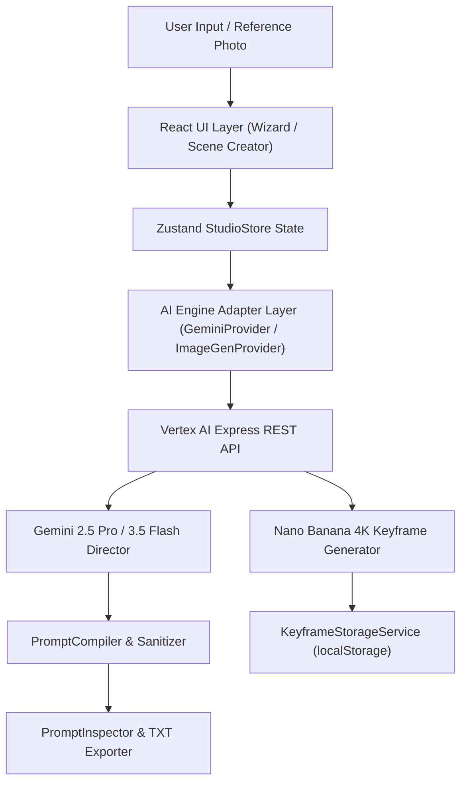

# System Architecture

## Overview & Flow Diagram

## Core Architectural Layers
1. **Presentation Layer (`src/components/`)**:
   - `Wizard.tsx`: 4-step guided storyboarding wizard
   - `SceneCreatorPanel.tsx`: 3-step 4K keyframe generator workstation
   - `AIDirectorPanel.tsx`: Multimodal visual storyboard builder
   - `PromptInspector.tsx`: Live prompt preview, validation, and copying
   - `Sidebar.tsx` & `Header.tsx`: Navigation and global mode controls (`T2VA`, `I2VA`, `FL2VA`, `L2VA`)

2. **Domain & Engine Layer (`src/engine/`)**:
   - `PromptCompiler.ts`: Pure function compiling project state into official MiniMax H3 format string
   - `ReferenceEngine.ts`: Compiles Part One Reference Alignment header
   - `CameraEngine.ts`: Formats camera motion sentences
   - `AudioEngine.ts`: Compiles soundscape and non-diegetic music sections
   - `TimelineEngine.ts`: Equal shot duration division logic
   - `PromptValidator.ts`: Quality check assertions

3. **AI Adapter Layer (`src/ai/`)**:
   - `GeminiProvider.ts`: Vertex AI REST API caller with smart global vs regional endpoint routing
   - `ImageGenProvider.ts`: Single & pair keyframe prompt expansion and Nano Banana image generation

4. **State Management (`src/store/StudioStore.ts`)**:
   - Central Zustand store managing project settings, shots, reference images, audio settings, and keyframes.
